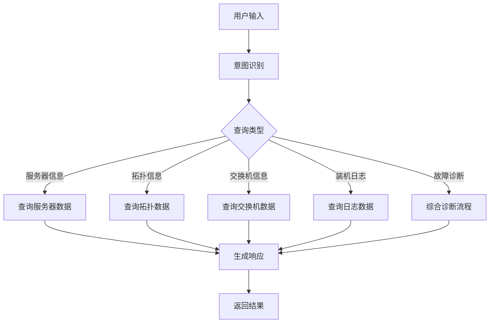
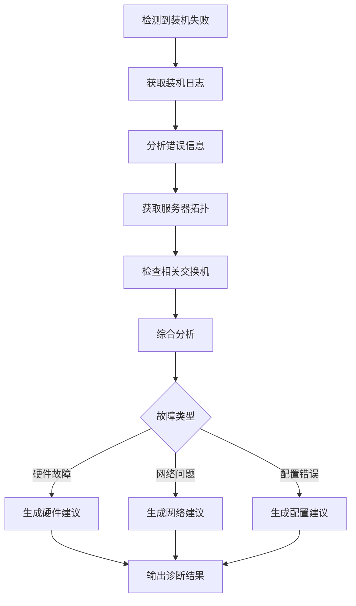

# 沧竹Agent（CZ-Agent）需求文档

## 项目概述

沧竹Agent是一个基于LangChain + LangGraph构建的智能运维助手，专注于数据中心服务器的监控、诊断和故障排查。当服务器安装失败时，能够综合分析多维度信息并提供具体的解决建议。

## 功能需求

### 1. 核心查询功能

#### 1.1 服务器信息查询
- 查询指定服务器的详细信息（CPU、内存、磁盘、网卡等）
- 获取服务器运行状态（在线/离线/维护中）
- 查看服务器基本配置和元数据

#### 1.2 服务器拓扑查询
- 展示服务器的带内/带外网络全局联通性视角
- 显示层级拓扑结构：Region → AZ → 机房(Room) → 机柜(Rack) → 服务器
- 查看服务器的上联交换机和网络路径
- 识别网络故障影响范围（如整个机柜带外不通可能是上联交换机问题）
- 支持按不同层级查看网络连通性状态

#### 1.3 交换机信息查询
- 获取与服务器相连的交换机信息
- 查看交换机端口状态和配置
- 展示交换机的网络连接状态

#### 1.4 服务器装机日志查询
- 获取服务器安装过程的详细日志
- 支持按时间范围筛选日志
- 识别日志中的错误和警告信息

### 2. 智能诊断功能

#### 2.1 故障自动诊断
当检测到服务器安装失败时，自动执行以下流程：
1. 获取失败服务器的装机日志
2. 查询服务器的网络拓扑信息
3. 检查相关交换机的状态
4. 综合分析多维度数据
5. 定位可能的故障原因

#### 2.2 建议生成
基于诊断结果，提供具体的解决建议：
- 硬件故障：建议更换特定组件
- 网络问题：建议检查特定交换机端口或网线
- 配置错误：提供正确的配置参数
- 环境问题：建议检查电源、温度等环境因素

### 3. 对话交互功能

支持自然语言查询，例如：
- "查看server-001的详细信息"
- "显示北京数据中心的服务器拓扑"
- "server-002装机失败了，帮我分析一下原因"
- "查看最近24小时内的所有装机失败记录"

## 技术架构

### 1. 系统架构

```
┌─────────────────┐     ┌──────────────────┐     ┌────────────────┐
│                 │     │                  │     │                │
│   用户界面      │────▶│   CZ-Agent       │────▶│  Mock MCP      │
│                 │     │  (LangChain +    │     │   Server       │
│                 │     │   LangGraph)     │     │                │
└─────────────────┘     └──────────────────┘     └────────────────┘
                                │
                                ▼
                        ┌──────────────────┐
                        │                  │
                        │   LLM Service    │
                        │  (DeepSeek等)    │
                        │                  │
                        └──────────────────┘
```

### 2. 技术栈

- **编程语言**: Python 3.8+
- **Agent框架**: LangChain + LangGraph
- **MCP通信**: 基于MCP协议的客户端/服务器架构
- **LLM支持**: 通过LiteLLM支持多种模型（DeepSeek、GPT等）
- **数据格式**: JSON格式的结构化数据

### 3. MCP接口设计

Mock MCP服务器需要提供以下接口：

#### 3.1 服务器信息接口
```python
# 获取服务器列表
list_servers() -> List[ServerSummary]

# 获取服务器详情
get_server_details(server_id: str) -> ServerDetails
```

#### 3.2 拓扑信息接口
```python
# 获取服务器拓扑
get_server_topology(server_id: str) -> TopologyInfo

# 获取数据中心拓扑
get_datacenter_topology(datacenter_id: str) -> DatacenterTopology
```

#### 3.3 交换机信息接口
```python
# 获取交换机信息
get_switch_info(switch_id: str) -> SwitchInfo

# 获取服务器关联的交换机
get_server_switches(server_id: str) -> List[SwitchInfo]
```

#### 3.4 装机日志接口
```python
# 获取装机日志
get_installation_logs(
    server_id: str, 
    start_time: Optional[datetime] = None,
    end_time: Optional[datetime] = None
) -> List[LogEntry]

# 获取失败的装机记录
get_failed_installations(
    start_time: Optional[datetime] = None,
    end_time: Optional[datetime] = None
) -> List[FailedInstallation]
```

## 数据模型

### 1. 服务器信息
```python
class ServerDetails:
    server_id: str
    hostname: str
    status: str  # online/offline/maintenance
    ip_address: str
    hardware: HardwareInfo
    location: LocationInfo
    created_at: datetime
    updated_at: datetime
```

### 2. 拓扑信息
```python
class TopologyInfo:
    server_id: str
    # 层级位置信息
    region: str
    availability_zone: str  # AZ
    room: str  # 机房
    rack_id: str  # 机柜
    rack_position: int  # 机柜内位置
    
    # 网络连接信息
    in_band_network: NetworkPath  # 带内网络路径
    out_of_band_network: NetworkPath  # 带外网络路径
    uplink_switches: List[SwitchConnection]  # 上联交换机
    
    # 连通性状态
    in_band_connectivity: ConnectivityStatus
    out_of_band_connectivity: ConnectivityStatus
    
class NetworkPath:
    path: List[str]  # 网络路径上的设备列表
    status: str  # connected/disconnected/partial
    last_hop_reachable: str  # 最后可达的设备
    
class ConnectivityStatus:
    is_connected: bool
    last_check_time: datetime
    failure_reason: Optional[str]  # 如"上联交换机故障"
```

### 3. 交换机信息
```python
class SwitchInfo:
    switch_id: str
    name: str
    model: str
    status: str
    ports: List[PortInfo]
    connected_servers: List[str]
```

### 4. 装机日志
```python
class LogEntry:
    timestamp: datetime
    level: str  # INFO/WARNING/ERROR
    message: str
    component: str  # 产生日志的组件
    details: Optional[Dict[str, Any]]
```

## 工作流设计

### 1. 查询处理流程



### 2. 故障诊断流程



## Mock数据设计

Mock MCP服务器应提供以下类型的测试数据：

### 1. 正常场景
- 10台正常运行的服务器
- 完整的网络拓扑结构
- 正常的交换机状态
- 成功的装机日志

### 2. 异常场景
- 2台离线服务器
- 1台装机失败的服务器（硬件故障）
- 1台装机失败的服务器（网络问题）
- 1台装机失败的服务器（配置错误）
- 部分交换机端口故障

### 3. 边界场景
- 空查询结果
- 超大日志文件
- 网络超时模拟

## 非功能需求

### 1. 性能要求
- 查询响应时间 < 2秒
- 支持并发查询
- 流式响应支持

### 2. 可靠性要求
- 优雅的错误处理
- MCP连接失败时的降级处理
- 日志记录和监控

### 3. 可扩展性
- 模块化设计，易于添加新的查询类型
- 支持多种LLM模型
- 易于集成到现有系统

### 4. 用户体验
- 清晰的错误提示
- 进度反馈
- 结构化的查询结果展示

## 项目交付物

1. **源代码**
   - CZ-Agent实现
   - Mock MCP服务器
   - 工具函数和辅助模块

2. **文档**
   - README.md - 项目说明和快速开始
   - API文档 - 详细的接口说明
   - 部署文档 - 部署和配置指南

3. **测试**
   - 单元测试
   - 集成测试
   - 示例脚本

4. **配置**
   - requirements.txt - Python依赖
   - 配置文件模板
   - Docker配置（可选）

## 开发计划

### 第一阶段：基础设施（1天）
- 创建Mock MCP服务器
- 实现基础数据模型
- 搭建项目结构

### 第二阶段：核心功能（2天）
- 实现CZ-Agent主体
- 集成LangChain和LangGraph
- 实现四类基础查询功能

### 第三阶段：智能诊断（1天）
- 实现故障诊断流程
- 开发建议生成算法
- 集成到Agent工作流

### 第四阶段：测试和优化（1天）
- 编写测试用例
- 性能优化
- 文档完善

## 总结

CZ-Agent将为数据中心运维人员提供一个智能的故障诊断助手，通过自然语言交互和多维度数据分析，快速定位和解决服务器安装过程中的问题，提高运维效率。