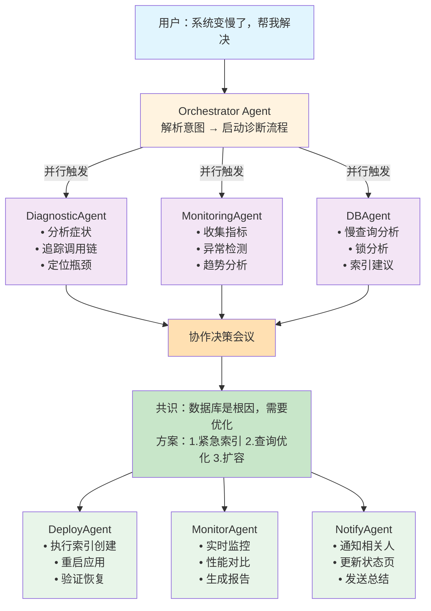
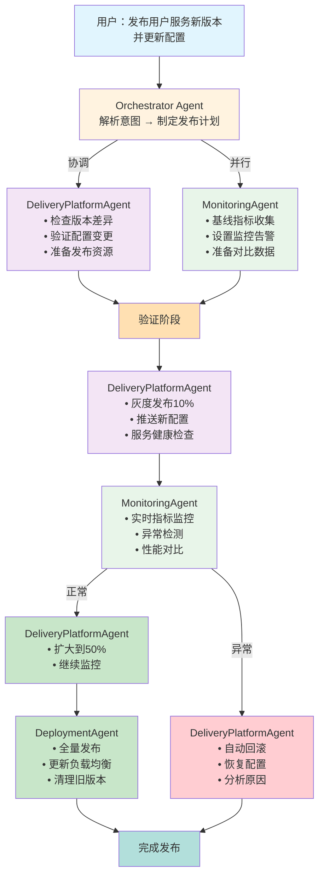
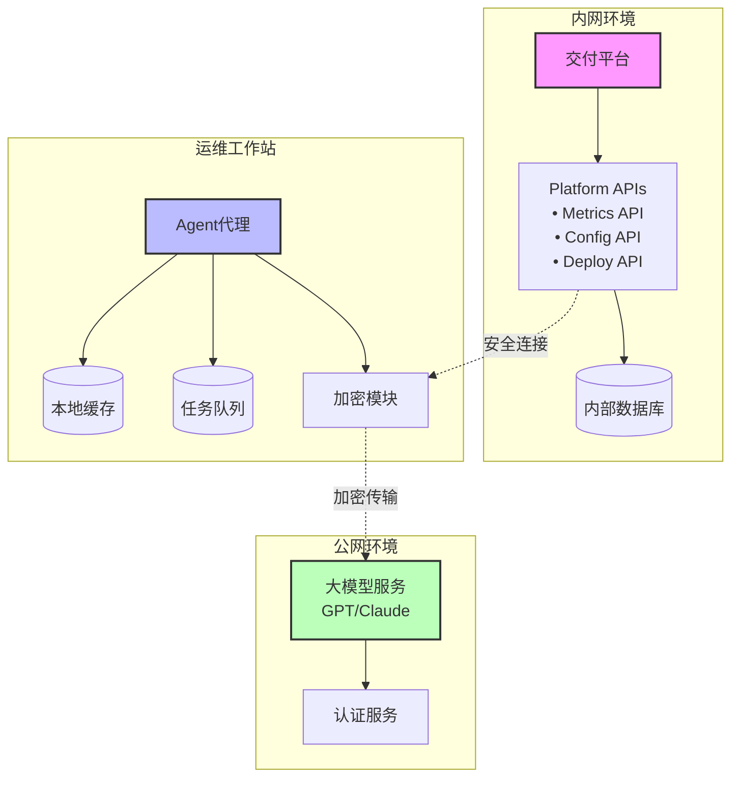
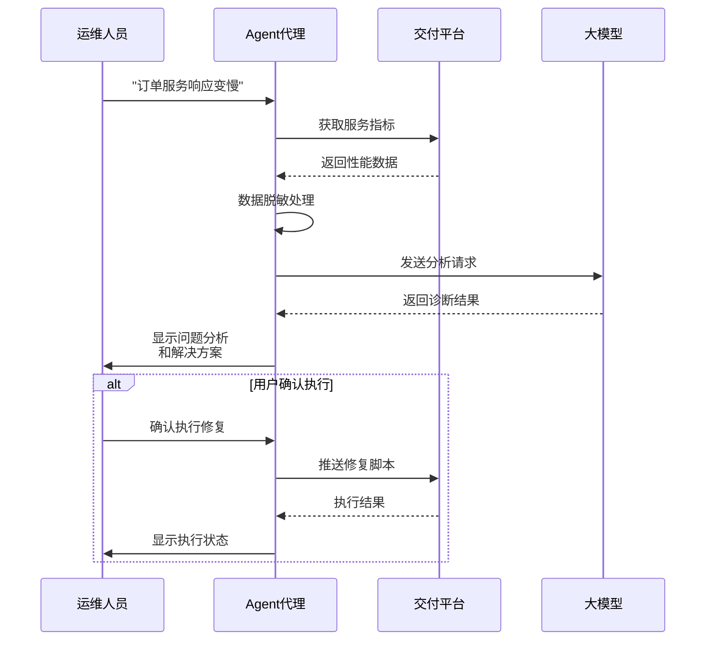
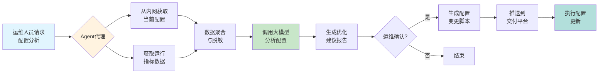

# 多Agent智能运维系统需求文档

## 1. 项目概述

### 1.1 背景
传统运维依赖人工操作和经验判断，面临效率低、易出错、知识传承困难等挑战。基于多Agent的智能运维系统通过自然语言交互和智能协作，实现运维工作的智能化和自动化。

### 1.2 目标
- 构建基于命令行的自然语言交互运维平台
- 实现多个专业Agent的智能协作机制
- 提供主动预测和自动修复能力
- 持续学习优化，降低运维复杂度

## 2. 系统架构

### 2.1 分层架构模型

```
┌─────────────────────────────────────────────┐
│         CLI 交互层                          │
│   • 自然语言理解  • 命令解析  • 实时反馈    │
├─────────────────────────────────────────────┤
│         Agent 编排层                        │
│   • 任务分解  • 智能调度  • 协作协调       │
├─────────────────────────────────────────────┤
│         专业 Agent 池                       │
│   • 部署  • 监控  • 诊断  • 数据库  • 交付  │
├─────────────────────────────────────────────┤
│         基础设施抽象层                      │
│   • 多云适配  • 资源管理  • API网关        │
└─────────────────────────────────────────────┘
```

### 2.2 核心组件
- **CLI交互层**：自然语言处理、意图识别、结果展示
- **Agent编排层**：任务分解、资源调度、协作管理
- **专业Agent池**：领域专家智能体集合
- **基础设施层**：统一资源抽象和管理

## 3. Agent设计

### 3.1 Agent基础能力
每个Agent都是独立的智能体，具备：
- **专业能力**：深度掌握特定领域知识
- **自主决策**：独立分析和执行任务
- **协作通信**：通过标准协议与其他Agent交互
- **学习进化**：从历史经验中持续优化

### 3.2 核心Agent类型

#### 3.2.1 DeploymentAgent（部署Agent）
- **能力**：应用部署、版本管理、回滚策略
- **决策**：最佳部署时机、灰度策略选择
- **特性**：
  - 支持多种部署模式（蓝绿、金丝雀、滚动）
  - 自动依赖检查和版本兼容性验证
  - 智能回滚决策

#### 3.2.2 MonitoringAgent（监控Agent）
- **能力**：指标采集、异常检测、趋势分析
- **决策**：告警阈值动态调整、问题预测
- **特性**：
  - 多维度指标关联分析
  - 智能告警降噪
  - 性能趋势预测

#### 3.2.3 DiagnosticAgent（诊断Agent）
- **能力**：故障定位、根因分析、影响评估
- **决策**：诊断路径优化、关联问题识别
- **特性**：
  - 分布式追踪分析
  - 智能日志聚合
  - 故障传播路径识别

#### 3.2.4 DatabaseAgent（数据库Agent）
- **能力**：性能优化、备份恢复、容量规划
- **决策**：索引优化建议、扩容时机
- **特性**：
  - 慢查询自动优化
  - 智能索引推荐
  - 容量趋势预测

#### 3.2.5 DeliveryPlatformAgent（交付平台Agent）
- **能力**：应用版本管理、环境配置管理、服务编排、资源调度
- **决策**：发布策略选择、资源分配优化、服务依赖管理
- **特性**：
  - 多环境管理（开发、测试、预发、生产）
  - 应用版本控制和回滚
  - 配置中心集成和动态配置推送
  - 服务注册发现和健康检查
  - 负载均衡策略管理
  - API网关路由配置
  - 服务网格治理（限流、熔断、重试）
  - 资源配额和成本优化

## 4. 协作机制

### 4.1 Agent间通信协议

```yaml
MessageStructure:
  header:
    id: uuid
    from_agent: agent_id
    to_agent: agent_id | broadcast
    intent_type: request | inform | negotiate | confirm
    priority: 1-10
    timestamp: iso8601
    
  intent:
    action: deploy | monitor | diagnose | optimize
    target: 
      type: service | database | infrastructure
      identifier: resource_id
    constraints:
      - time_window
      - resource_limits
      - dependencies
      
  context:
    current_state: system_snapshot
    historical_data: relevant_metrics
    related_tasks: task_id_list
    
  negotiation:
    proposal: suggested_approach
    alternatives: backup_plans
    confidence: 0.0-1.0
```

### 4.2 任务编排流程
```
用户意图 → NLU解析 → 任务分解 → Agent匹配 → 并行执行 → 结果聚合
```

### 4.3 分布式决策机制
- **本地分析**：评估能力匹配、资源可用性、执行风险
- **协同谈判**：能力广播、提案交换、收益计算
- **共识达成**：基于改进Raft算法的投票机制

## 5. CLI交互设计

### 5.1 自然对话式交互示例

#### 部署场景
```bash
$ ops-agent "部署新版本的用户服务到生产环境"

🤖 理解您的需求：部署 user-service 到生产环境
📋 当前版本：v2.3.1 → 新版本：v2.4.0

🔍 DeploymentAgent 分析中...
  ✓ 代码变更：+1,234行 -567行
  ✓ 数据库迁移：无需执行
  ✓ 配置变更：新增2个环境变量
  
⚡ MonitoringAgent 评估中...
  ✓ 当前流量：2,341 QPS (正常)
  ✓ 错误率：0.02% (健康)
  ✓ 建议部署窗口：10分钟后（流量低谷）


📊 部署计划：
  1. 灰度10%流量（5分钟）
  2. 监控关键指标
  3. 自动扩展到100%
  
确认执行？(y/n/详情):
```

#### 诊断场景
```bash
$ ops-agent "为什么CPU使用率突然升高？"

🔍 DiagnosticAgent 启动诊断...

📈 检测到异常：
  - 时间：15:23 开始
  - 影响：API响应时间增加23%
  - 范围：user-service (3个实例)

🧠 根因分析：
  1. 数据库慢查询增加 (73% 可能性)
     → 发现未命中索引的查询
     → 影响：/api/user/profile 接口
  
  2. 内存泄漏 (15% 可能性)
     → GC频率正常，排除
  
  3. 外部依赖延迟 (12% 可能性)
     → Redis响应正常，排除

💡 建议操作：
  1. 立即：添加缺失索引 (预计5秒完成)
  2. 短期：优化查询逻辑
  3. 长期：实施查询缓存

执行紧急修复？(y/n):
```

#### 配置管理场景
```bash
$ ops-agent "更新生产环境的数据库连接配置"

🔧 DeliveryPlatformAgent 配置管理中...

📋 当前配置：
  环境: production
  服务: user-service (3个实例)
  配置项: database.connection
  
🔍 配置变更分析：
  原值: mysql://prod-db-01:3306/users
  新值: mysql://prod-db-cluster:3306/users
  
  影响范围：
  - user-service (3个实例)
  - order-service (间接依赖)
  - notification-service (读依赖)

⚡ MonitoringAgent 风险评估：
  - 当前连接数: 342 (正常)
  - 数据库负载: 45% (健康)
  - 建议：分批更新，避免连接风暴

📊 更新策略：
  1. 灰度推送到1个实例（观察5分钟）
  2. 扩展到剩余实例
  3. 验证服务健康状态
  4. 同步更新依赖服务
  
💡 安全措施：
  - 配置备份已创建
  - 回滚脚本已准备
  - 监控告警已设置

确认执行配置更新？(y/n/调整策略):
```

### 5.2 交互特性
- 支持自然语言输入
- 实时进度反馈
- 智能上下文理解
- 交互式确认机制

## 6. 智能特性

### 6.1 学习和优化机制

```yaml
LearningFramework:
  ExperienceCapture:
    - 任务执行路径记录
    - 决策点和选择理由
    - 执行结果和性能指标
    - 异常情况和处理方式
    
  PatternMining:
    - 成功模式提取
    - 失败原因分析
    - 优化机会识别
    - 新场景泛化
    
  KnowledgeEvolution:
    - Agent能力动态更新
    - 协作策略优化
    - 风险模型调整
    - 决策阈值自适应
```

### 6.2 预测性运维

```yaml
PredictiveOps:
  TimeSeriesAnalysis:
    - 多维度指标关联
    - 季节性模式识别
    - 异常趋势预警
    
  CapacityPlanning:
    - 资源使用预测
    - 扩容时机建议
    - 成本优化方案
    
  FailurePrediction:
    - 故障模式学习
    - 风险评分模型
    - 预防措施推荐
```

### 6.3 自适应策略
- 根据时间段调整行为（高峰期更谨慎）
- 基于成功率动态调整策略
- 系统状态感知的智能降级

## 7. 多Agent协作案例

### 7.1 数据库性能问题处理流程

用户："系统变慢了，帮我解决"



### 7.2 应用发布和配置更新流程

用户："发布用户服务新版本并更新配置"



## 8. 安全和合规

### 8.1 安全框架

```yaml
SecurityFramework:
  Authentication:
    - 多因素身份验证
    - 基于角色的权限控制
    - 操作审计日志
    
  Compliance:
    - 自动合规检查
    - 变更审批流程
    - 证据收集归档
    
  DataProtection:
    - 敏感信息脱敏
    - 加密通信通道
    - 安全密钥管理
```

### 8.2 审计要求
- 所有操作记录完整审计日志
- 支持合规性报告生成
- 变更追踪和回溯能力

## 9. 技术要求

### 9.1 性能指标
- 命令响应时间 < 2秒
- Agent决策时间 < 5秒
- 并发任务处理 > 1000
- 系统可用性 > 99.9%

### 9.2 可扩展性
- 支持动态添加新Agent
- 插件化架构设计
- 水平扩展能力

### 9.3 集成要求
- 支持主流云平台（AWS、Azure、GCP、阿里云）
- 兼容Kubernetes、Docker环境
- 提供标准API接口

## 10. 实施路线图

### Phase 1 - 基础框架（3个月）
- CLI交互框架搭建
- Agent基础架构实现
- 核心通信协议开发

### Phase 2 - 核心Agent（3个月）
- 实现5个核心Agent
- 基础协作机制
- 简单场景验证

### Phase 3 - 智能增强（2个月）
- 机器学习能力集成
- 预测性功能开发
- 自适应优化实现

### Phase 4 - 生产就绪（2个月）
- 安全合规完善
- 性能优化
- 大规模测试

## 11. 成功指标

- **效率提升**：运维操作时间减少 70%
- **错误降低**：人为操作失误减少 90%
- **自动化率**：常见问题自动解决率 > 80%
- **用户满意度**：NPS评分 > 8.5

## 12. 风险和挑战

### 12.1 技术风险
- Agent间协作复杂度控制
- 自然语言理解准确性
- 分布式一致性保证

### 12.2 应对策略
- 采用成熟的分布式框架
- 持续优化NLP模型
- 完善的测试和回滚机制

## 13. 网络隔离场景用户故事

### 13.1 背景说明
在企业内网环境中，交付平台通常部署在与互联网隔离的机房中，无法直接访问公网大模型服务。但运维人员的办公电脑可以同时访问内网和公网，因此需要通过本地Agent代理来桥接两个网络。

### 13.2 用户故事：通过本地Agent代理实现内网交付平台的智能运维

**角色**：张工 - 某银行运维工程师

**场景**：负责管理部署在内网机房的交付平台，由于安全合规要求，机房网络与互联网完全隔离。

**需求**："作为一名运维工程师，我希望能在我的办公电脑上运行一个智能Agent代理，让它能够桥接内网交付平台和公网大模型，帮助我完成复杂的运维任务，提高工作效率。"

### 13.3 技术架构



### 13.4 典型使用场景

#### 场景1：智能故障诊断流程



#### 场景2：配置优化建议流程



### 13.5 关键特性实现

#### 13.5.1 安全机制
- **端到端加密**：所有数据传输使用TLS 1.3
- **数据脱敏**：敏感信息本地处理，不发送到公网
- **访问控制**：基于证书的双向认证
- **审计日志**：完整记录所有操作

#### 13.5.2 性能优化
- **智能缓存**：常用分析结果本地存储
- **批量处理**：支持任务队列和异步执行
- **增量同步**：仅传输变化的数据
- **离线模式**：基础功能本地支持

#### 13.5.3 使用示例

```bash
# 启动Agent代理
$ ops-agent-proxy start \
    --internal-api=https://delivery-platform.internal:8443 \
    --mode=bridge \
    --cache-dir=/var/cache/ops-agent \
    --tls-cert=/etc/ops-agent/cert.pem

# 智能诊断
$ ops-agent-proxy diagnose "用户服务CPU使用率异常"

# 配置分析
$ ops-agent-proxy analyze-config user-service --env=production

# 发布管理
$ ops-agent-proxy deploy payment-service:v3.2.0 --strategy=canary
```

### 13.6 验收标准
1. **连接稳定性**：Agent代理能够稳定连接内网API，断线自动重连
2. **安全合规**：所有数据传输加密，敏感信息不外泄
3. **响应性能**：常规诊断任务5秒内返回结果
4. **任务恢复**：支持任务中断后的恢复机制
5. **审计完整**：提供完整的操作日志和审计追踪

### 13.7 实施收益
- **效率提升**：复杂问题诊断时间从小时级降至分钟级
- **知识复用**：大模型积累的运维知识可应用于内网环境
- **安全保障**：满足金融级安全合规要求
- **成本节约**：无需在内网部署昂贵的AI基础设施

## 14. 总结

多Agent智能运维系统通过自然语言交互和智能协作，将传统被动响应式运维转变为主动预测式运维。系统的核心价值在于：

1. **降低运维复杂度** - 自然语言交互，无需记忆复杂命令
2. **提高决策质量** - 多Agent协作，综合多维度信息
3. **加速问题解决** - 自动诊断和修复，减少MTTR
4. **持续智能进化** - 从每次操作中学习，不断优化
5. **适应网络隔离** - 通过Agent代理桥接内外网，充分利用AI能力

该系统将彻底改变运维工作模式，实现真正的智能化和自动化运维，特别是在网络隔离的企业环境中，通过创新的代理架构设计，让AI赋能成为可能。